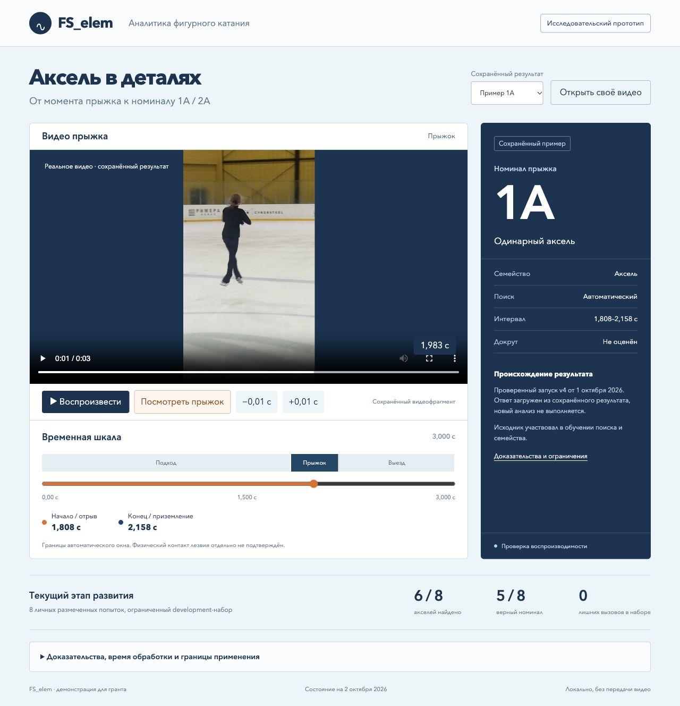
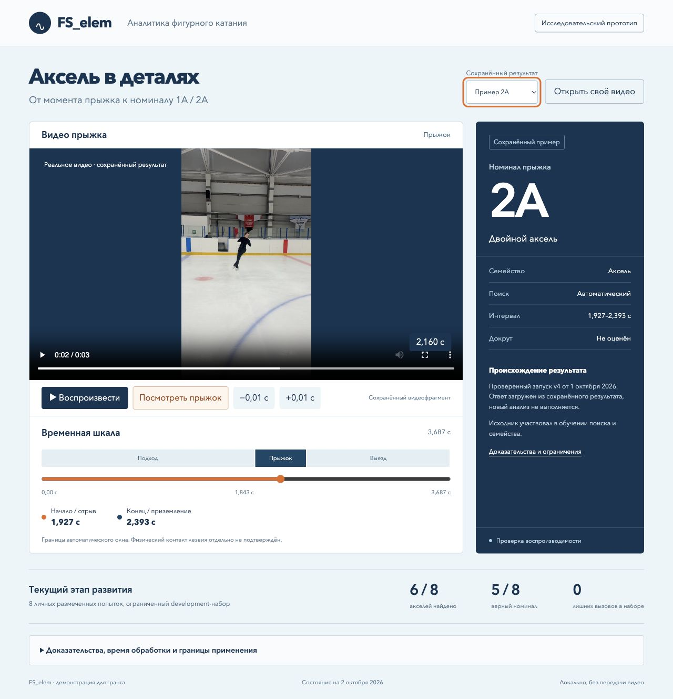

# FS_elem

Исследовательский модуль анализа прыжков в фигурном катании. Ближайшая цель — автоматическое обнаружение акселя и номинальная классификация 1A/2A; затем 3A. Оценка докрута является отдельной, пока невалидированной стадией.

## Демонстрация прототипа

```sh
python3 grant-demo/serve.py
```

Откройте http://127.0.0.1:5210/ . Работает offline, без npm и моделей. Интерфейс показывает два реальных тренировочных видео с сохранёнными результатами 1A/2A и синхронной шкалой времени. Публичное размещение именно этих двух фрагментов разрешено пользователем. Выбор своего видео даёт только просмотр, без распознавания. [Происхождение и ограничения](grant-demo/PROVENANCE.md).





## Что реализовано

Основной редактор `apps/web` + `server` + `services/analysis` работает отдельно от исследовательского ML-конвейера. Редактор поддерживает локальные видео, события, разметку и хранение. Исследовательский runtime `scripts/run_axel_research.py` выполняет поиск → семейство → номинал на базе RTMW и реальных PTS. Pose существует в исследовательской ветви; демонстрация не вызывает её автоматически.

Состояние на 02.10.2026: в ограниченном personal development-наборе N8/D6/C5/FP0, 1A C4/5, 2A C1/3. Два знакомых коротких source smoke v4 дают N2/D2/C2/FP0 в каждом режиме cold/warm и подтверждают воспроизводимость. Они пересекаются с обучением поиска/семейства. Независимые70%, новые спортсмены, realtime и production-ready не подтверждены. Последние два варианта номинального классификатора отклонены; working_anchor сохранён.

## Объём публичного пакета

Это curated snapshot исходников, не копия всех исследовательских данных и не готовая поставка inference. `PUBLICATION_MANIFEST.json` фиксирует файлы и SHA, `PUBLICATION.md` — исключения, зависимости, изменения публичной копии и лицензирование. История исходного checkout не переписана. Шесть source-only helper-файлов runtime сохранены в прежних относительных путях `work/`; исключённые веса, env и receipt-данные необходимы для реального анализа.

Для основного редактора нужны Node24 и pnpm11, установка зависимостей `pnpm --dir apps/web install --frozen-lockfile`; запуск `npm start`, проверки `npm test`, `npm run typecheck`. Импорт исходного dataset для редактора не включён. Чистая установка редактора на другом устройстве этим пакетом не проверялась. Исследовательские Python-зависимости перечислены отдельно в `services/analysis/requirements-science.txt` и `requirements-pose.txt`.

LICENSE проекта ещё не выбран владельцем. Публикация не предоставляет произвольно выбранную open-source лицензию. Лицензии сторонних библиотек сохраняют силу. Включены только два разрешённых коротких видео примеров; модели, остальные видео и dataset спортсменов не включены.

## Архитектура и состояние

[Архитектура модуля](docs/grant/2026-10-02/architecture.md), [состояние разработки](docs/grant/2026-10-02/development-state.json). Внутренние акты по текущему поручению в публикацию не включены.
