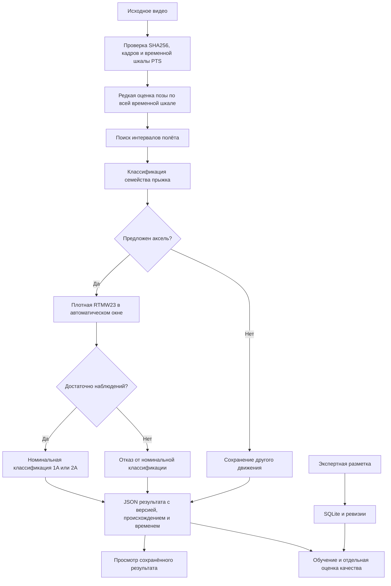

# Архитектура прототипа FS_elem

Состояние описано на 2 октября 2026 года. FS_elem — исследовательский программный модуль анализа видео фигурного катания. Первая цель — автоматически находить аксель и определять его номинальный класс 1A или 2A. Проект содержит работающий редактор экспертной разметки, отдельный исследовательский конвейер анализа и демонстрационный интерфейс. Они пока не объединены в готовый многопользовательский сервис.

Организация, указанная заявителем: МОО «ФФККЛ». Роль заявителя: ведущий ML-инженер, самозанятый. Полное юридическое название, состав команды, основание выполнения работ и принадлежность прав подтверждаются организацией отдельно.

## Пользовательский сценарий

Тренер просматривает видео, выбирает попытку и сопоставляет найденный системой интервал с изображением. Результат показывает семейство прыжка и номинальный класс. Если наблюдений недостаточно, модель сохраняет отказ от классификации. Экспертные исправления и временные границы хранятся отдельно от предложений модели.

Демонстрация для гранта показывает два реальных тренировочных видео — исходники сохранённых результатов 1A и 2A. Пользователь подтвердил разрешение на публичное размещение именно этих двух фрагментов. Видео синхронизировано со шкалой и сохранёнными границами прыжка; кнопка воспроизводит прыжок с контекстом. Выбор своего локального видео позволяет его просматривать; новый анализ в этой статической демонстрации не выполняется. Неподтверждённая схема суставов поверх видео не рисуется.

## Компоненты

| Компонент | Реализация и назначение | Текущее состояние |
|---|---|---|
| Редактор разметки | `apps/web`, React и TypeScript; просмотр видео, эпизоды, события фаз, экспертные метки | Работает локально |
| API и хранение | `server/api.mjs`, `store.mjs`, `validation.mjs`, Node.js и SQLite | Проверка данных, транзакции, история ревизий, обнаружение конфликтов |
| Импорт данных | `server/importer.mjs`, `scripts/import.mjs` | Проверка исходников и контрольных сумм, импорт в отдельный набор |
| Сервис готовности | `services/analysis/server.py` | `/health`; сообщает `inferenceAvailable: false`; не выполняет ML-анализ |
| Исследовательский анализ | `scripts/run_axel_research.py`, конфигурация `configs/axel-research-runtime-v4.json`, отдельные Python-среды | Выполняется через CLI на текущем стенде |
| Извлечение позы | Детектор человека YOLOX, оценка позы RTMW, ONNX Runtime и OpenCV; плотные первые 23 точки wholebody | Используются существующие сторонние модели |
| Классификаторы | Сохранённые модели поиска полёта, семейства прыжка и номинального класса | Отдельные роли и версии; результат зависит от качества данных |
| Проверка качества | Экспертные события, сведения о происхождении данных, оценщик `scripts/evaluate_axel_pipeline.py` | Выявляет пропуски, неверный номинал и лишние вызовы |
| Грантовая демонстрация | `grant-demo/`, автономный статический интерфейс | Представление сохранённых примеров; без серверного ML |

Порты и абсолютные пути относятся к локальному стенду. Публичный репозиторий содержит код и инструкции; публикация кода сама по себе не делает локальный сервис доступным через интернет.

## Поток данных

Экспертные ответы и ручные границы целевого видео не читаются исследовательским CLI для формирования его прогноза. Они используются при последующем сравнении с результатом. Редактор и демонстрация пока не запускают этот конвейер через единый продуктовый API.

## Последовательность исследовательского анализа

1. Проверяются исходное видео, размеры, кадры, монотонность временной шкалы и совместимость с конфигурацией. Используются действительные времена представления кадров, а не только пересчёт по номинальной частоте.
2. По всей шкале выполняется редкая оценка позы, целевая частота около 8,33 кадра/с. Геометрические признаки 68D и временной контекст 340D подаются в модель поиска полёта. В конфигурации v4 закреплён порог 0,3.
3. Для кандидатов вычисляются признаки семейства 545D. Только автоматические окна, классифицированные как аксель, поступают на плотное извлечение позы.
4. RTMW23 возвращает координаты в пикселях оригинального видео. По этим данным вычисляются признаки 81D и предложение номинального класса 1A/2A. При недостаточном наблюдении торса или спектральных признаков итоговый номинал остаётся `null`.
5. Сохраняется JSON: интервалы, семейство, номинал, причина отказа, версии и хеши входов, время этапов, сведения об использовании кэша и пересечении исходника с обучением.

Числовые оценки классификаторов и сырые оценки позы не являются подтверждёнными вероятностями правильности. Класс 1A/2A не равен измерению непрерывного угла вращения тела. Поля недокрута и физического числа оборотов в воздухе в этой версии остаются `null`.

## Достоверность данных и воспроизводимость

Видео, обученные модели, конфигурации и код привязываются контрольными суммами SHA-256. Для v4 конфигурация имеет SHA-256 `7b3d029ec114b010ac578340a4d92428dd4f64e48b34d5a49c2a90c328e23a76`. Изменённая конфигурация требует новой версии; перенос абсолютных путей не сохраняет прежний хеш автоматически.

Кэш связан с исходником и рецептом. Обязательный манифест фиксирует четыре файла: `timeline.json`, `sparse.json`, `dense-request.json`, `dense.json`. Проверяются их хеши, временная шкала, геометрия, окна и происхождение позы. Незавершённый или повреждённый кэш отклоняется. Повторное открытие кэша измеряется отдельно от обработки нового видео.

Разметка хранит источник, тип подтверждения и неопределённость границ. Запись судейского протокола не становится автоматически подтверждённой меткой по видео. Альтернативные ракурсы одной попытки должны принадлежать одной группе при разделении обучения и проверки. Глобальная независимость по спортсменам пока не подтверждена.

## Подтверждённое состояние

На сохранённой личной development-выборке из восьми размеченных попыток рабочий вариант обнаружил шесть и правильно определил номинал пяти. В этой ограниченной проверке лишних вызовов нет. Это 5/8, или 62,5%, для совместного результата поиска и номинальной классификации. Выборка используется в разработке; результат не является независимой точностью продукта.

Два знакомых коротких исходника в v4 обработаны сначала с пустым pose-кэшем, затем с проверенным кэшем; результаты 1A и 2A совпали. Первый запуск занял 38,90 и 41,65 с, повторный — 2,10 и 1,84 с. Оба источника пересекаются с обучением поиска/семейства. Эти замеры подтверждают воспроизводимость на стенде, а не анализ нового видео в реальном времени.

Последние два варианта изменения номинального классификатора ухудшили результат на контрольных примерах и были отклонены. Рабочая база сохранена. Результаты проверки, включая отрицательные, фиксируются отдельно от продуктовых возможностей.

## Ограничения и следующий этап

Нужны независимая проверка полных видео с разделением по спортсменам и попыткам, дополнительные подтверждённые примеры 1A, сокращение пропусков и ложных срабатываний, замер производительности на одинаковых новых входах и проверка чистой установки. Исследовательский v4 пока зависит от локальных весов, сред и ряда модулей в `work/`; публикация должна перечислять эти зависимости явно.

После подтверждения 1A/2A планируются 3A и отдельное исследование недокрута с видимыми контактами лезвия и экспертной оценкой. Сервис авторизации, серверная очередь анализа, интеграция с трансляциями и масштабирование относятся к будущему развитию. Текущий стенд рассчитан на локальную работу, а не на промышленную эксплуатацию.

## Основания описания

- Описание v4, команда и замеры — `docs/grant/2026-10-02/../../research/axel-single-recipe-runtime-2026-10-01.md` (внутренний источник; не включён в публичную копию).
- Состояние исследовательских запусков — `docs/grant/2026-10-02/../../axel-runtime.md` (внутренний источник; не включён в публичную копию).
- [Схема хранения](../../schema-v2.md).
- Принятие последнего сравнения моделей — `docs/grant/2026-10-02/../../research/audit-evidence-2026-10-01/nominal81d-matched-fit-v3-actual-posthoc-coordinator-acceptance-2026-10-02.json` (внутренний источник; не включён в публичную копию).
- [Снимок технических свидетельств](development-state.json).
